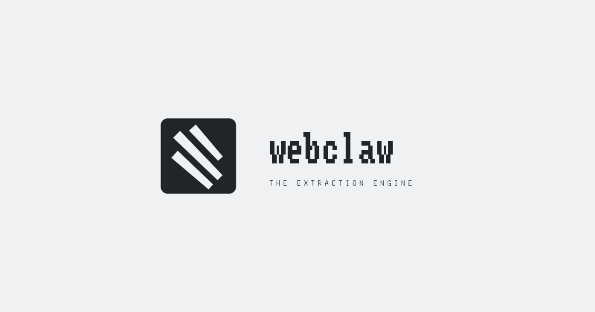

<p align="center">
  <a href="https://webclaw.io">
    
  </a>
</p>

<p align="center">
  <strong>Go SDK for the Webclaw web extraction API</strong>
</p>

<p align="center">
  <a href="https://pkg.go.dev/github.com/0xMassi/webclaw-go"></a>
  <a href="https://github.com/0xMassi/webclaw-go/blob/main/LICENSE"></a>
  <a href="https://go.dev"></a>
</p>

---

> **Note**: The webclaw Cloud API is currently in closed beta. [Request early access](https://webclaw.io) or use the [open-source CLI/MCP](https://github.com/0xMassi/webclaw) for local extraction.

---

## Installation

```bash
go get github.com/0xMassi/webclaw-go
```

## Quick Start

```go
package main

import (
    "context"
    "fmt"

    webclaw "github.com/0xMassi/webclaw-go"
)

func main() {
    client := webclaw.NewClient("wc_your_api_key")

    result, err := client.Scrape(context.Background(), webclaw.ScrapeRequest{
        URL:     "https://example.com",
        Formats: []webclaw.Format{webclaw.FormatMarkdown},
    })
    if err != nil {
        panic(err)
    }
    fmt.Println(result.Markdown)
}
```

## Endpoints

### Scrape

Extract content from a single URL.

```go
result, err := client.Scrape(ctx, webclaw.ScrapeRequest{
    URL:              "https://example.com",
    Formats:          []webclaw.Format{webclaw.FormatMarkdown, webclaw.FormatText},
    IncludeSelectors: []string{"article", ".content"},
    ExcludeSelectors: []string{"nav", "footer"},
    OnlyMainContent:  true,
    NoCache:          true,
})
```

### Crawl

Start an async crawl and poll for results.

```go
job, err := client.Crawl(ctx, webclaw.CrawlRequest{
    URL:        "https://example.com",
    MaxDepth:   3,
    MaxPages:   100,
    UseSitemap: true,
})

// Poll until complete
status, err := client.WaitForCrawl(ctx, job.ID, 2*time.Second, 5*time.Minute)

for _, page := range status.Pages {
    fmt.Println(page.URL, len(page.Markdown))
}
```

### Map

Discover URLs via sitemap.

```go
result, err := client.Map(ctx, webclaw.MapRequest{URL: "https://example.com"})
for _, u := range result.URLs {
    fmt.Println(u)
}
```

### Batch

Scrape multiple URLs in parallel.

```go
result, err := client.Batch(ctx, webclaw.BatchRequest{
    URLs:        []string{"https://a.com", "https://b.com"},
    Formats:     []webclaw.Format{webclaw.FormatMarkdown},
    Concurrency: 5,
})
for _, item := range result.Results {
    fmt.Println(item.URL, item.Error)
}
```

### Extract

LLM-powered structured data extraction.

```go
// Schema-based
result, err := client.Extract(ctx, webclaw.ExtractRequest{
    URL:    "https://example.com/pricing",
    Schema: json.RawMessage(`{"type":"object","properties":{"plans":{"type":"array"}}}`),
})

// Prompt-based
result, err = client.Extract(ctx, webclaw.ExtractRequest{
    URL:    "https://example.com",
    Prompt: "Extract all pricing tiers",
})
```

### Summarize

```go
result, err := client.Summarize(ctx, webclaw.SummarizeRequest{
    URL:          "https://example.com",
    MaxSentences: 3,
})
fmt.Println(result.Summary)
```

### Brand

Extract brand identity (colors, fonts, logos).

```go
result, err := client.Brand(ctx, webclaw.BrandRequest{URL: "https://example.com"})
fmt.Println(string(result.Data))
```

### Search

Web search with optional scraping of results.

```go
resp, err := client.Search(ctx, &webclaw.SearchRequest{
    Query: "web scraping tools 2026",
})
for _, r := range resp.Results {
    fmt.Println(r.Title, r.URL)
}
```

### Research

Start an async deep research job and poll for results.

```go
// Start a research job
job, err := client.Research(ctx, &webclaw.ResearchRequest{
    Query:      "How do modern web crawlers handle JavaScript rendering?",
    MaxSources: 15,
    Deep:       true,
})

// Poll until done
result, err := client.WaitForResearch(ctx, job.ID, nil)
fmt.Println(result.Report)
```

## Error Handling

```go
result, err := client.Scrape(ctx, req)
if err != nil {
    var apiErr *webclaw.APIError
    if errors.As(err, &apiErr) {
        fmt.Printf("Status %d: %s\n", apiErr.StatusCode, apiErr.Message)
    }
}
```

## Configuration

```go
client := webclaw.NewClient(
    "wc_your_api_key",
    webclaw.WithBaseURL("https://api.webclaw.io"),
    webclaw.WithTimeout(60 * time.Second),
    webclaw.WithHTTPClient(customClient),
)
```

## Highlights

- Zero dependencies beyond `net/http`
- `context.Context` on every method
- Functional options pattern
- All errors are `*APIError` with status codes

## License

MIT
