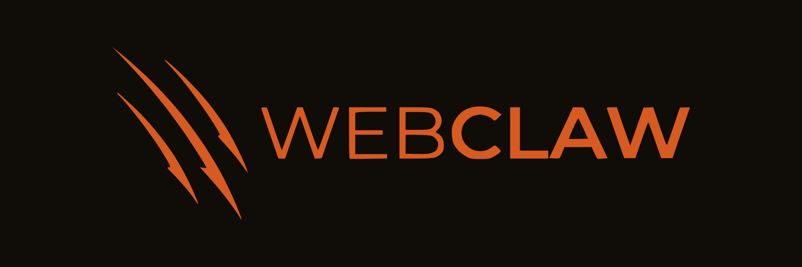

<p align="center">
  <a href="https://webclaw.io">
    
  </a>
</p>

<p align="center">
  <strong>Go SDK for the Webclaw web extraction API</strong>
</p>

<p align="center">
  <a href="https://pkg.go.dev/github.com/0xMassi/webclaw-go"></a>
  <a href="https://github.com/0xMassi/webclaw-go/stargazers"></a>
  <a href="https://github.com/0xMassi/webclaw-go/blob/main/LICENSE"></a>
  <a href="https://go.dev"></a>
</p>

---

> **Note**: The webclaw Cloud API is public. Create an API key at [webclaw.io](https://webclaw.io) or use the [open-source CLI/MCP](https://github.com/0xMassi/webclaw) for local extraction.

---

## Installation

```bash
go get github.com/0xMassi/webclaw-go
```

## Quick Start

```go
package main

import (
    "context"
    "fmt"
    "os"

    webclaw "github.com/0xMassi/webclaw-go"
)

func main() {
    client := webclaw.NewClient(os.Getenv("WEBCLAW_API_KEY"))

    result, err := client.Scrape(context.Background(), &webclaw.ScrapeRequest{
        URL:     "https://example.com",
        Formats: []webclaw.Format{webclaw.FormatMarkdown},
    })
    if err != nil {
        panic(err)
    }
    fmt.Println(result.Markdown)
}
```

## Highlights

- Zero dependencies beyond `net/http`
- `context.Context` on every method for cancellation and timeouts
- Functional options pattern for client configuration
- Typed errors with helper functions (`IsRateLimited`, `IsAuthError`, `IsNotFound`)
- Async polling helpers for crawl and research jobs

## Configuration

```go
client := webclaw.NewClient(
    os.Getenv("WEBCLAW_API_KEY"),
    webclaw.WithBaseURL("https://api.webclaw.io"),
    webclaw.WithTimeout(60 * time.Second),
    webclaw.WithHTTPClient(customHTTPClient),
)
```

| Option | Description |
|--------|-------------|
| `WithBaseURL(url)` | Override the default API base URL (`https://api.webclaw.io`) |
| `WithTimeout(d)` | Set the HTTP client timeout (default: 30s) |
| `WithHTTPClient(c)` | Replace the default `*http.Client` entirely |

## Endpoints

### Scrape

Extract content from a single URL.

```go
result, err := client.Scrape(ctx, &webclaw.ScrapeRequest{
    URL:              "https://example.com",
    Formats:          []webclaw.Format{webclaw.FormatMarkdown, webclaw.FormatText},
    IncludeSelectors: []string{"article", ".content"},
    ExcludeSelectors: []string{"nav", "footer"},
    OnlyMainContent:  true,
    NoCache:          true,
})
if err != nil {
    log.Fatal(err)
}
fmt.Println(result.Markdown)
fmt.Println(result.Cache.Status) // "hit", "miss", or "bypass"
```

### Vertical extractors

28 site-specific extractors that return typed JSON (GitHub, Reddit, Amazon, YouTube, PyPI, HuggingFace, Trustpilot, etc.) instead of generic markdown. See the [catalog](https://webclaw.io/docs/api/vertical) for the full list.

```go
// Discover available extractors
catalog, err := client.ListExtractors(ctx)
if err != nil { log.Fatal(err) }
for _, e := range catalog.Extractors {
    fmt.Println(e.Name, "-", e.Label)
}

// Run a specific extractor
pr, err := client.ScrapeVertical(
    ctx,
    "github_pr",
    "https://github.com/rust-lang/rust/pull/123456",
)
if err != nil { log.Fatal(err) }
fmt.Println(pr.Data) // map[string]any with title, state, author, etc.
```

The `Data` field is `map[string]any`; consult `ListExtractors` for the fields each extractor returns.

### Search

Web search with optional scraping of results.

```go
resp, err := client.Search(ctx, &webclaw.SearchRequest{
    Query:      "web scraping tools 2026",
    NumResults: 10,
    Country:    "us",
})
if err != nil {
    log.Fatal(err)
}
for _, r := range resp.Results {
    fmt.Printf("%d. %s — %s\n", r.Position, r.Title, r.URL)
}
```

### Map

Discover URLs on a site via its sitemap.

```go
result, err := client.Map(ctx, &webclaw.MapRequest{
    URL: "https://example.com",
})
if err != nil {
    log.Fatal(err)
}
fmt.Printf("Found %d URLs\n", result.Count)
for _, u := range result.URLs {
    fmt.Println(u)
}
```

### Endpoints

Discover API endpoints embedded in a page's inline JavaScript and linked `<script src>` bundles -- references a sitemap-based `Map` cannot reach.

```go
result, err := client.Endpoints(ctx, &webclaw.EndpointsRequest{
    URL:               "https://example.com",
    IncludeThirdParty: false, // first-party hosts only (default)
    MaxBundles:        20,    // cap external bundles scanned (max 20)
})
if err != nil {
    log.Fatal(err)
}
fmt.Printf("Scanned %d bundles, found %d endpoints\n", result.BundlesScanned, result.EndpointCount)
for _, ep := range result.Endpoints {
    fmt.Printf("%s [%s] first_party=%v src=%s\n", ep.Value, ep.Kind, ep.FirstParty, ep.Source)
}
fmt.Println("Hosts:", result.Hosts)
if result.Truncated {
    fmt.Println("Results truncated -- raise MaxBundles or narrow the target")
}
```

`Kind` is one of `relative_path`, `absolute_url`, `graph_ql`, or `web_socket`.

### Batch

Scrape multiple URLs in parallel.

```go
result, err := client.Batch(ctx, &webclaw.BatchRequest{
    URLs:        []string{"https://a.com", "https://b.com", "https://c.com"},
    Formats:     []webclaw.Format{webclaw.FormatMarkdown},
    Concurrency: 5,
})
if err != nil {
    log.Fatal(err)
}
for _, item := range result.Results {
    if item.Error != "" {
        fmt.Printf("FAIL %s: %s\n", item.URL, item.Error)
        continue
    }
    fmt.Printf("OK   %s (%d bytes)\n", item.URL, len(item.Markdown))
}
```

### Extract

LLM-powered structured data extraction. Provide either a JSON schema or a natural-language prompt.

```go
// Schema-based extraction
result, err := client.Extract(ctx, &webclaw.ExtractRequest{
    URL:    "https://example.com/pricing",
    Schema: json.RawMessage(`{"type":"object","properties":{"plans":{"type":"array"}}}`),
})
if err != nil {
    log.Fatal(err)
}
fmt.Println(string(result.Data))

// Prompt-based extraction
result, err = client.Extract(ctx, &webclaw.ExtractRequest{
    URL:    "https://example.com/pricing",
    Prompt: "Extract all pricing tiers with name, price, and features",
})
```

### Lead Enrichment API

Turn a company URL into a structured sales lead: company name, summary, socials, tech stack, pricing plans, categorized contact emails, and the founders behind the company — each with their LinkedIn and X profiles when discoverable. `PeopleSource` reports how the founder list was resolved.

**Billing:** a flat **100 credits** per successful lead.

```go
result, err := client.Lead(ctx, &webclaw.LeadRequest{
    URL: "https://resend.com",
})
if err != nil {
    log.Fatal(err)
}

lead := result.Lead
fmt.Printf("%s (%s) — %s\n", lead.CompanyName, result.Domain, lead.Summary)
fmt.Printf("Socials: linkedin=%s x=%s github=%s\n", lead.Socials.LinkedIn, lead.Socials.X, lead.Socials.GitHub)
fmt.Println("Tech:", lead.Tech)

for _, p := range lead.Pricing {
    fmt.Printf("  plan %s — %s\n", p.Plan, p.Price)
}
for _, e := range lead.Emails {
    fmt.Printf("  %s: %s\n", e.Type, e.Email)
}
for _, person := range lead.People {
    linkedin, x := "", ""
    if person.LinkedIn != nil {
        linkedin = *person.LinkedIn
    }
    if person.X != nil {
        x = *person.X
    }
    fmt.Printf("  %s — %s (linkedin=%s x=%s)\n", person.Name, person.Role, linkedin, x)
}

fmt.Printf("People source: %s\n", result.PeopleSource)
fmt.Printf("Cache: %s, Credits: %d\n", result.Cache, result.Credits)
```

### Summarize

Generate a plain-text summary of a page.

```go
result, err := client.Summarize(ctx, &webclaw.SummarizeRequest{
    URL:          "https://example.com/blog/long-article",
    MaxSentences: 3,
})
if err != nil {
    log.Fatal(err)
}
fmt.Println(result.Summary)
```

### Brand

Extract brand identity information (colors, fonts, logos) from a URL. The response is a flexible JSON object since the shape depends on the target site.

```go
result, err := client.Brand(ctx, &webclaw.BrandRequest{
    URL: "https://example.com",
})
if err != nil {
    log.Fatal(err)
}
fmt.Println(string(result.Data))

// Decode into a custom struct
var brand struct {
    Name   string   `json:"name"`
    Colors []string `json:"colors"`
}
if err := result.Decode(&brand); err != nil {
    log.Fatal(err)
}
fmt.Println(brand.Name, brand.Colors)
```

### Diff

Compare the current state of a page against a previous snapshot to detect changes.

```go
result, err := client.Diff(ctx, &webclaw.DiffRequest{
    URL: "https://example.com/pricing",
    Previous: map[string]interface{}{
        "title": "Old Pricing Page",
        "price": "$9.99",
    },
})
if err != nil {
    log.Fatal(err)
}
fmt.Println(result.Changes)
```

### Research

Start an async deep research job and poll for results. Research can take several minutes depending on the query and configuration.

```go
// Start the job
job, err := client.Research(ctx, &webclaw.ResearchRequest{
    Query:      "How do modern web crawlers handle JavaScript rendering?",
    MaxSources: 15,
    Deep:       true,
})
if err != nil {
    log.Fatal(err)
}
fmt.Printf("Research job started: %s\n", job.ID)

// Poll until complete (default: 2s interval, 10min timeout)
result, err := client.WaitForResearch(ctx, job.ID, nil)
if err != nil {
    log.Fatal(err)
}
fmt.Println(result.Report)
fmt.Printf("Sources: %d, Findings: %d\n", result.SourcesCount, result.FindingsCount)

// Or poll manually
status, err := client.GetResearchStatus(ctx, job.ID)

// Custom poll options
result, err = client.WaitForResearch(ctx, job.ID, &webclaw.ResearchPollOptions{
    Interval: 5 * time.Second,
    Timeout:  15 * time.Minute,
})
```

### Crawl

Start an async crawl job and poll until completion.

```go
// Start the crawl
job, err := client.Crawl(ctx, &webclaw.CrawlRequest{
    URL:        "https://example.com",
    MaxDepth:   3,
    MaxPages:   100,
    UseSitemap: true,
})
if err != nil {
    log.Fatal(err)
}
fmt.Printf("Crawl started: %s\n", job.ID)

// Poll until complete (default: 2s interval, no timeout beyond parent context)
status, err := client.WaitForCompletion(ctx, job.ID, nil)
if err != nil {
    log.Fatal(err)
}
fmt.Printf("Crawled %d/%d pages (%d errors)\n", status.Completed, status.Total, status.Errors)
for _, page := range status.Pages {
    if page.Error != "" {
        fmt.Printf("FAIL %s: %s\n", page.URL, page.Error)
        continue
    }
    fmt.Printf("OK   %s (%d bytes)\n", page.URL, len(page.Markdown))
}

// Or poll manually
status, err = client.GetCrawl(ctx, job.ID)

// Custom poll options
status, err = client.WaitForCompletion(ctx, job.ID, &webclaw.CrawlPollOptions{
    Interval: 5 * time.Second,
    Timeout:  10 * time.Minute,
})
```

### Watch

Monitor URLs for changes over time. Create watches, list them, check them manually, and clean up.

**Create a watch**

```go
watch, err := client.WatchCreate(ctx, &webclaw.WatchCreateRequest{
    URL:             "https://example.com/pricing",
    Name:            "Pricing page",
    IntervalMinutes: 60,
    WebhookURL:      "https://hooks.example.com/webclaw",
})
if err != nil {
    log.Fatal(err)
}
fmt.Printf("Watch created: %s (checks every %d min)\n", watch.ID, watch.IntervalMinutes)
```

**List watches**

```go
list, err := client.WatchList(ctx, 20, 0) // limit=20, offset=0
if err != nil {
    log.Fatal(err)
}
for _, w := range list.Watches {
    fmt.Printf("%s — %s (active: %v)\n", w.ID, w.URL, w.Active)
}
```

**Get watch details with snapshots**

```go
detail, err := client.WatchGet(ctx, "watch_id_here")
if err != nil {
    log.Fatal(err)
}
fmt.Printf("URL: %s, Last changed: %s\n", detail.URL, detail.LastChangedAt)
for _, snap := range detail.Snapshots {
    fmt.Printf("  %s — %d words (delta: %+d)\n", snap.CheckedAt, snap.WordCount, snap.WordCountDelta)
}
```

**Trigger a manual check**

```go
resp, err := client.WatchCheck(ctx, "watch_id_here")
if err != nil {
    log.Fatal(err)
}
fmt.Println(resp.Status)
```

**Delete a watch**

```go
err := client.WatchDelete(ctx, "watch_id_here")
if err != nil {
    log.Fatal(err)
}
```

### X (Twitter) monitors

Monitor X (Twitter) profiles, searches, lists, or replies and fire a webhook when new matching tweets appear — the X analog of `Watch`. **Paid-only:** these methods return a 403 (`IsForbidden`) for free or lapsed accounts. Each check (automated or manual) is billed at your plan rate (Starter 5, Growth 3, Pro 2, Scale 1 credits), and a user may hold at most 50 monitors.

**Create a monitor**

```go
active := true
monitor, err := client.CreateXMonitor(ctx, &webclaw.XMonitorCreateRequest{
    Kind:            webclaw.XMonitorProfile, // profile | search | list | replies
    Target:          "@nasa",                 // leading @ is stripped
    Name:            "NASA posts",
    IntervalMinutes: 15,                       // default 15, clamped 2..10080
    WebhookURL:      "https://hooks.example.com/x", // Discord/Slack/generic
    IncludeRetweets: &active,                  // *bool: nil = server default (true)
    MinFaves:        100,                      // only match tweets with ≥100 likes
    Keyword:         "launch",                 // only match tweets containing this
})
if err != nil {
    if webclaw.IsForbidden(err) {
        log.Fatal("X monitors are a paid feature — upgrade your account")
    }
    log.Fatal(err)
}
fmt.Printf("Monitor created: %s (checks every %d min)\n", monitor.ID, monitor.IntervalMinutes)
```

`Target` is interpreted per `Kind`: a handle (`profile`), a search query (`search`), a list id (`list`), or a tweet id (`replies`). The `IncludeRetweets`/`IncludeReplies`/`IncludeQuotes` fields are `*bool` so you can send an explicit `false`; leave them `nil` to accept the server default of `true`.

**List monitors**

```go
list, err := client.ListXMonitors(ctx, 20, 0) // limit=20, offset=0
if err != nil {
    log.Fatal(err)
}
for _, m := range list.Monitors {
    fmt.Printf("%s — %s:%s (active: %v)\n", m.ID, m.Kind, m.Target, m.Active)
}
```

**Get a monitor**

```go
monitor, err := client.GetXMonitor(ctx, "monitor_id_here")
if err != nil {
    log.Fatal(err)
}
fmt.Printf("%s — last checked %s, last matched %s\n",
    monitor.Target, monitor.LastCheckedAt, monitor.LastMatchedAt)
```

**Update a monitor** (all fields optional — pause, rename, re-target the webhook, or change the interval)

```go
paused := false
newName := "NASA (paused)"
resp, err := client.UpdateXMonitor(ctx, "monitor_id_here", &webclaw.XMonitorUpdateRequest{
    Name:   &newName,
    Active: &paused,
})
if err != nil {
    log.Fatal(err)
}
fmt.Println(resp.Success)
```

**Trigger a manual check** (runs in the background; billed at your plan rate)

```go
resp, err := client.CheckXMonitor(ctx, "monitor_id_here")
if err != nil {
    log.Fatal(err)
}
fmt.Println(resp.Status) // "checking"
```

**Delete a monitor**

```go
resp, err := client.DeleteXMonitor(ctx, "monitor_id_here")
if err != nil {
    log.Fatal(err)
}
fmt.Println(resp.Success)
```

When a monitor matches new tweets, webclaw POSTs your `WebhookURL`. Discord and Slack URLs receive native embed/text formatting; any other URL receives a generic JSON payload:

```json
{
  "event": "x.monitor.matched",
  "monitor_id": "...",
  "kind": "profile",
  "target": "nasa",
  "new_count": 2,
  "tweets": [
    {
      "id": "...", "screen_name": "NASA", "text": "...", "url": "...",
      "created_at": "...", "favorite_count": 1200, "retweet_count": 340,
      "reply_count": 55, "lang": "en",
      "is_retweet": false, "is_reply": false, "is_quote": false
    }
  ],
  "checked_at": "..."
}
```

### X (Twitter) audience export

Export the followers or following of an X account, cursor-paginated and metered. **Paid-only** (`IsForbidden` on free/lapsed accounts); each page fetched is billed at your plan rate (Starter 5, Growth 3, Pro 2, Scale 1 credits).

Provide either `Handle` (resolved once, unbilled) or a pre-resolved `UserID`. To walk a full audience, call repeatedly, passing back the returned `UserID` and `NextCursor`, until `NextCursor` is `nil`:

```go
req := &webclaw.XAudienceRequest{
    Handle:    "@jack",
    Direction: webclaw.XAudienceFollowers, // followers (default) | following
    MaxPages:  2,                          // default 2, clamped 1..10
}
for {
    page, err := client.ExportXAudience(ctx, req)
    if err != nil {
        if webclaw.IsForbidden(err) {
            log.Fatal("audience export is a paid feature")
        }
        log.Fatal(err)
    }
    for _, u := range page.Users {
        fmt.Printf("@%s (%d followers) — %s\n", u.ScreenName, u.Followers, u.Name)
    }
    fmt.Printf("page: %d users, %d pages fetched, %d credits\n",
        page.Count, page.PagesFetched, page.CreditsCharged)

    if page.NextCursor == nil {
        break // audience fully walked
    }
    req.UserID = page.UserID    // skip re-resolving the handle on later pages
    req.Cursor = *page.NextCursor
}
```

## Error Handling

All API errors are returned as `*webclaw.APIError` with the HTTP status code and message. Use the helper functions to check for common error types.

```go
result, err := client.Scrape(ctx, &webclaw.ScrapeRequest{URL: "https://example.com"})
if err != nil {
    if webclaw.IsRateLimited(err) {
        // Back off and retry
        log.Println("Rate limited, retrying after delay...")
    } else if webclaw.IsAuthError(err) {
        // Invalid or expired API key
        log.Fatal("Authentication failed. Check your WEBCLAW_API_KEY.")
    } else if webclaw.IsNotFound(err) {
        log.Println("Resource not found")
    } else {
        // Generic API error
        var apiErr *webclaw.APIError
        if errors.As(err, &apiErr) {
            log.Printf("API error %d: %s\n", apiErr.StatusCode, apiErr.Message)
        } else {
            // Network or other non-API error
            log.Printf("Request failed: %v\n", err)
        }
    }
    return
}
```

## All Methods

| Method | Signature | Description |
|--------|-----------|-------------|
| `Scrape` | `(ctx, *ScrapeRequest) (*ScrapeResponse, error)` | Extract content from a URL |
| `Search` | `(ctx, *SearchRequest) (*SearchResponse, error)` | Web search |
| `Map` | `(ctx, *MapRequest) (*MapResponse, error)` | Discover URLs via sitemap |
| `Endpoints` | `(ctx, *EndpointsRequest) (*EndpointsResponse, error)` | Discover API endpoints in page JS |
| `Batch` | `(ctx, *BatchRequest) (*BatchResponse, error)` | Multi-URL parallel scrape |
| `Extract` | `(ctx, *ExtractRequest) (*ExtractResponse, error)` | LLM structured extraction |
| `Lead` | `(ctx, *LeadRequest) (*LeadResponse, error)` | Lead enrichment (100 credits/lead) |
| `Summarize` | `(ctx, *SummarizeRequest) (*SummarizeResponse, error)` | Page summarization |
| `Brand` | `(ctx, *BrandRequest) (*BrandResponse, error)` | Brand identity extraction |
| `Diff` | `(ctx, *DiffRequest) (*DiffResponse, error)` | Content change detection |
| `Research` | `(ctx, *ResearchRequest) (*ResearchStartResponse, error)` | Start research job |
| `GetResearchStatus` | `(ctx, id) (*ResearchResponse, error)` | Poll research status |
| `WaitForResearch` | `(ctx, id, *ResearchPollOptions) (*ResearchResponse, error)` | Block until research completes |
| `Crawl` | `(ctx, *CrawlRequest) (*CrawlStartResponse, error)` | Start crawl job |
| `GetCrawl` | `(ctx, id) (*CrawlStatusResponse, error)` | Poll crawl status |
| `WaitForCompletion` | `(ctx, id, *CrawlPollOptions) (*CrawlStatusResponse, error)` | Block until crawl completes |
| `WatchCreate` | `(ctx, *WatchCreateRequest) (*WatchEntry, error)` | Create URL watch |
| `WatchList` | `(ctx, limit, offset) (*WatchListResponse, error)` | List watches |
| `WatchGet` | `(ctx, id) (*WatchDetail, error)` | Get watch with snapshots |
| `WatchDelete` | `(ctx, id) error` | Delete watch |
| `WatchCheck` | `(ctx, id) (*WatchCheckResponse, error)` | Trigger manual check |
| `CreateXMonitor` | `(ctx, *XMonitorCreateRequest) (*XMonitor, error)` | Create X (Twitter) monitor |
| `ListXMonitors` | `(ctx, limit, offset) (*XMonitorListResponse, error)` | List X monitors |
| `GetXMonitor` | `(ctx, id) (*XMonitor, error)` | Get one X monitor |
| `UpdateXMonitor` | `(ctx, id, *XMonitorUpdateRequest) (*XMonitorMutationResponse, error)` | Update an X monitor |
| `DeleteXMonitor` | `(ctx, id) (*XMonitorMutationResponse, error)` | Delete an X monitor |
| `CheckXMonitor` | `(ctx, id) (*XMonitorCheckResponse, error)` | Trigger an immediate X monitor check |
| `ExportXAudience` | `(ctx, *XAudienceRequest) (*XAudienceResponse, error)` | Export X followers/following (metered) |

## License

MIT
